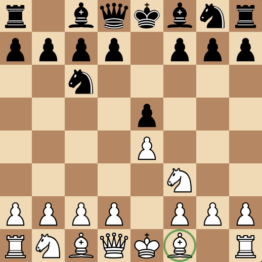

# Board Representation

So, now that you're familiar with the game of Chess, let's take a look again at what a chess board looks like.


Unfortunately, it's not really practical to just store a picture of the board in memory, so we need to come up with a more clever solution to representing this chess board.

## Mailbox

The first method to representing the pieces on a chess board is what the chess world calls a "mailbox", which is an array of values representing all the different possible states a square can be. This can be a 1D or 2D array and usually consists of a `Piece` enum of all 13 states: 12 pieces and a final enum for an empty square.

```cs
public enum Piece
{
    WhitePawn,    BlackPawn,
    WhiteKnight,  BlackKnight,
    WhiteBishop,  BlackBishop,
    WhiteRook,    BlackRook,
    WhiteQueen,   BlackQueen,
    WhiteKing,    BlackKing,
    
    Empty
}
```

They can be in any order, but having an order like the example shown allows you to get the type of a piece using a right-shift of 1, and the colour of a piece using a bitwise AND of 1.

### Using a 1D Array

Then, we can just initiate the mailbox:
```cs
Piece[] Mailbox = new Piece[64];
```

However, there is a problem: when you initiate an array of enums in C#, it fills it with zeroes or the zero-equivalent of the enum (the enum attribute with a value of 0). With the way, we've initiated it, because `Piece.WhitePawn` is the zero-equivalent enum, it will fill the array with a bunch of white pawns on all the squares.

So, if you were to display the board state, it would look like this:


This is clearly not what an empty board looks like, so we have to correct it by filling the array with the equivalent of empty squares: `Piece.Empty`:

```cs
Array.Fill(Mailbox, Piece.Empty);
```

And now, if we display our board, we get a blank board:


Never has nothing been so appealing.

### Using a 2D array

Again, using a 2D array is much like the 1D array: you initiate the array:

```cs
Piece[,] Mailbox2D = new Piece[8, 8];
```

Then fill it with pieces:
```cs
for (int i = 0; i < 8; i++)
{
    for (int j = 0; j < 8; j++)
    {
        Mailbox2D[i, j] = Piece.Empty();
    }
}
```

There isn't really much else to say, other than 2D arrays are slower than a 1D array and that you would have to split a single index into two indexes with a division and modulus.

## Applying a Mailbox

Say we had the following position:



And we wanted to know the moves of the bishop on f1. How would we go about this?

Well, our mailbox looks something like this:
```yml
[
    r, -, b, q, k, b, n, r,
    p, p, p, p, -, p, p, p,
    -, -, n, -, -, -, -, -,
    -, -, -, -, p, -, -, -,
    -, -, -, -, P, -, -, -,
    -, -, -, -, -, N, -, -,
    P, P, P, P, -, P, P, P,
    R, N, B, Q, K, B, -, R
]
```

And these are the indexes of the array:
```yml
[
     0,  1,  2,  3,  4,  5,  6,  7,
     8,  9, 10, 11, 12, 13, 14, 15,
    16, 17, 18, 19, 20, 21, 22, 23,
    24, 25, 26, 27, 28, 29, 30, 31,
    32, 33, 34, 35, 36, 37, 38, 39,
    40, 41, 42, 43, 44, 45, 46, 47,
    48, 49, 50, 51, 52, 53, 54, 55,
    56, 57, 58, 59, 60, 61, 62, 63
]
```

We can check from the square the bishop is on with the indexes and we see it's on square 61.

Now, the question comes: how do we move diagonally?

Well, if you take any square, you'll see that to move left and right is to add or subtract 1, or, more appropriately speaking, apply an offset of 1 or -1. And to move up and down, we apply an offset of 8 for down and -8 for up. The same goes for diagonals, with all offsets shown below:

```yml
NW N NE       -9  -8  -7
W  .  E   =>  -1   .   1
SW S SE        7   8   9
```

Bishops move diagonally, which are the offsets `-9`, `-7`, `7`, and `9`. We can package these in an array, then iterate through them when we check for all the moves:

```cs

```