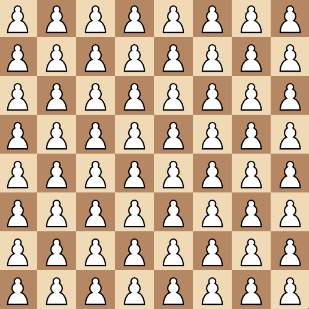
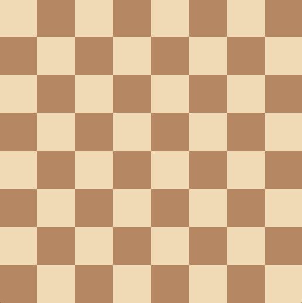
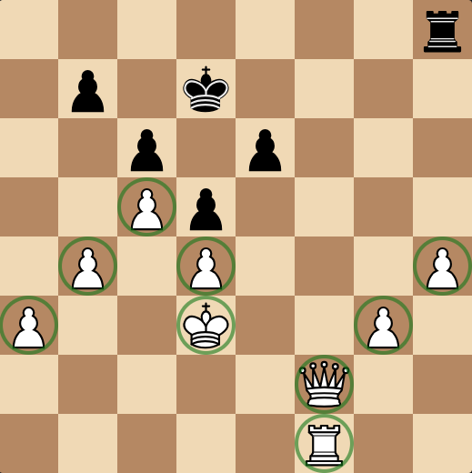

# Board Representation

So, now that you're familiar with the game of Chess, let's take a look again at what a chess board looks like.


Unfortunately, it's not really practical to just store a picture of the board in memory, so we need to come up with a more clever solution to representing this chess board.

## Mailbox

The first method to representing the pieces on a chess board is what the chess world calls a "mailbox", which is an array of values representing all the different possible states a square can be. This can be a 1D or 2D array and usually consists of a `Piece` enum of all 13 states: 12 pieces and a final enum for an empty square.

```cs
public enum Piece
{
    WhitePawn,    BlackPawn,
    WhiteKnight,  BlackKnight,
    WhiteBishop,  BlackBishop,
    WhiteRook,    BlackRook,
    WhiteQueen,   BlackQueen,
    WhiteKing,    BlackKing,
    
    Empty
}
```

They can be in any order, but having an order like the example shown allows you to get the type of a piece using a right-shift of 1, and the colour of a piece using a bitwise AND of 1.

### Using a 1D Array

Using a 1D array, this is how we initiate the array:
```cs
Piece[] Mailbox = new Piece[64];
```

However, there is a problem: when you initiate an array of enums in C#, it fills it with zeroes or the zero-equivalent of the enum (the enum attribute with a value of 0) for integer types. With the way, we've initiated it, because `Piece.WhitePawn` is the zero-equivalent enum, it will fill the array with a bunch of white pawns on all the squares.

So, if you were to display the board state, it would look like this:



This is clearly not what an empty board looks like, so we have to correct it by filling the array with the equivalent of empty squares: `Piece.Empty`:

```cs
Array.Fill(Mailbox, Piece.Empty);
```

And now, if we display our board, we get a blank board:



Never has nothing been so appealing.

### Using a 2D array

Again, using a 2D array is much like the 1D array: you initiate the array:

```cs
Piece[,] Mailbox2D = new Piece[8, 8];
```

Then fill it with pieces:
```cs
for (int i = 0; i < 8; i++)
{
    for (int j = 0; j < 8; j++)
    {
        Mailbox2D[i, j] = Piece.Empty();
    }
}
```

There isn't really much else to say, other than 2D arrays are slower than a 1D array and that you would have to split a single index into two indexes with a division and modulus. Although, it is more intuitive because the board is an 8x8 grid, so it makes sense to store it in an 8x8 "memory grid", otherwise known as a 2D array.

However, there's a much better option that removes the need for anything to do with arrays: bitboards.

## Using Bitboards - The Best Option

The term "bitboard" refers to a number where the bits in its binary representation encode information about a game board's state. In English, that's basically a binary number where the bits represent something about the board. In the context of Chess, this could be lines of attack, pieces on the board, where you can and cannot castle, etc. Bitboards are typically used when there are two states for something: it's there, and it's not.

For example, take this position here:


If I asked you where all of White's piece are, you'd probably describe something that amounts to this:



On each square, there can either be a white piece, or there can't be. If we assign 1 to "there **is** a piece here", and 0 to "there **isn't** a piece here", we get something like this:

```yml
0 0 0 0 0 0 0 0
0 0 0 0 0 0 0 0
0 0 0 0 0 0 0 0
0 0 1 0 0 0 0 0
0 1 0 1 0 0 0 1
1 0 0 1 0 0 1 0
0 0 0 0 0 1 0 0
0 0 0 0 0 1 0 0
```

A grid of zeroes and ones representing where all of White's pieces are. With these zeroes and ones, we can pack them with binary:

```yml
#  8th row, 7th row, 6th row, you get the point...
0b 00000000 00000000 00000000 00100000 01010001 10010010 00000100 00000100
```

### Computer Architecture

Another benefit to our binary approach is the fact that pretty much all CPU's have architecture that lets them operate on data in 64-bit chunks at a time with _incredible_ speed. As in multiple billions of times a second, incredible speed. We can leverage this by using bitboards for our Chess game, as we can unlock ridiculously fast speeds with this method.

## My Decision - and Everyone Else's

The consensus in the Stockfish Discord server is that the best approach is a bitboard implementation **combined** with a 1-dimensional array, which serves as our mailbox. You might be wondering, considering what I said earlier, "Why are we using an array if bitboards are quicker?" It's because, this time, it's not used for move generation - it's used for piece lookup. We keep an array of 64 "pieces" that let us know what's on a given square. This is useful, because if you wanted to know what piece was on `A1`, you only have to access the part of an array that `A1` points to, instead of going through all the bitboards and checking to see if any of the bits intersect.

For information on how I implemented my bitboards (and how I show them here), [turn to the following page.](./Bitboard_Representation.md)