## Rooks

Rooks are the castle-looking pieces, and can usually be found in all four corners of the board, when pieces are arranged in the starting position:

 

They move orthogonally (horizontally and vertically) in all four directions for as many squares as possible, only stopped by another piece on the board, as you can see below:

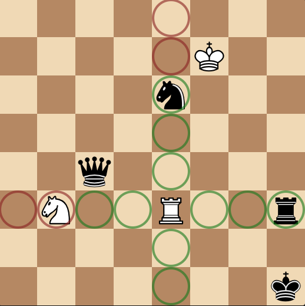

Rooks can only move up until a friendly piece and only onto an enemy piece - they cannot jump over them. They are worth five points (5 times as good as a pawn) and each player gets two of them.

## Bishops

Much like a rook, they move in straight lines, except this time it's diagonally. They are found beside the king and queen on the board.

 

And, much like a rook, they also cannot jump over pieces.

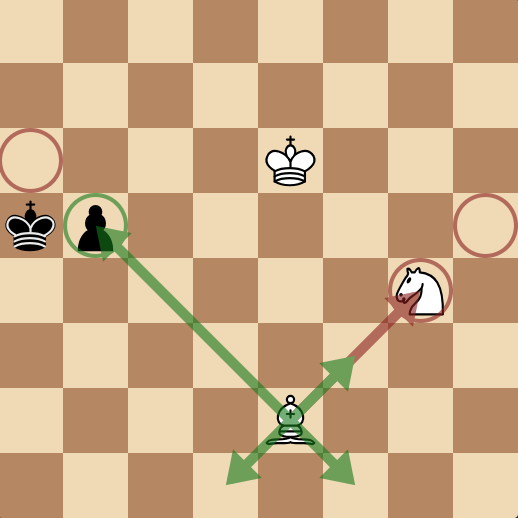

In Chess, a bishop is usually considered to be worth three points (3 times as good as a pawn) and each player gets two of them.

## Queens

A queen is a combination of a rook and a bishop, and it is the strongest piece on the board, being worth 9 points (5 + 3 + 1 extra for style points).

 

Their movements are, as described earlier, a combination of a rook's and a bishop's:

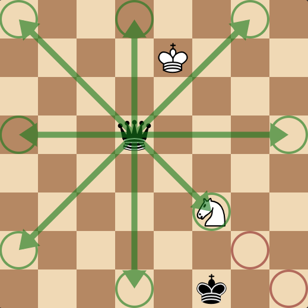

Each player gets only one of these, making it an extremely valuable asset, and usually considered a complete loss for less advanced players if their queen gets taken.

## Knights

A knight is a unique piece in the chess world. It is worth three points and each player gets two of them.

 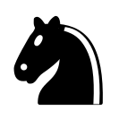

For a start, it's the only piece that can jump over other pieces, and its path of movement is also not in a straight line like all the other pieces. Commonly described as an L-shape, the knight moves two squares orthogonally, then one square perpendicular to the chosen direction.

For example, two squares left and one square up or down:

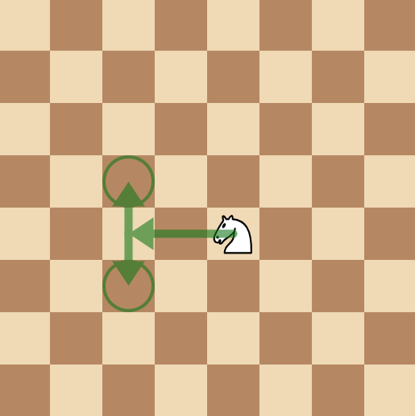

And here are all the moves that can be made with the directions I explained earlier:

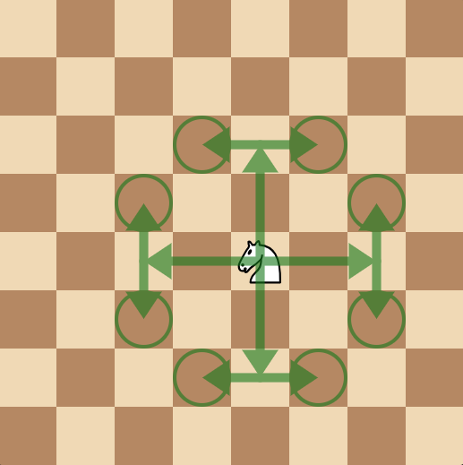

The best part about knights is that they always move in these paths, meaning we can make a small lookup table for all the possible moves that can be easily generated.

## King

The king is the weakest piece in the whole army, but you must protect him or you will lose the game. He doesn't have a material worth, because for him to be captured, an illegal move must be played.

 

He moves in every direction like the queen, but only moves one space, instead of to the end of the board:

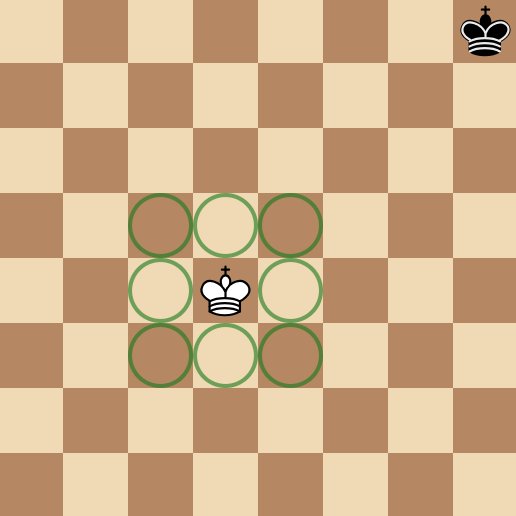

Kings cannot play any moves where they will be taken on the next move, meaning they cannot step into any lines of attack:

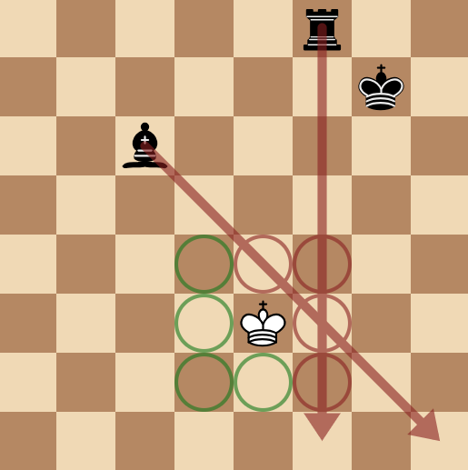

And they cannot capture protected pieces:

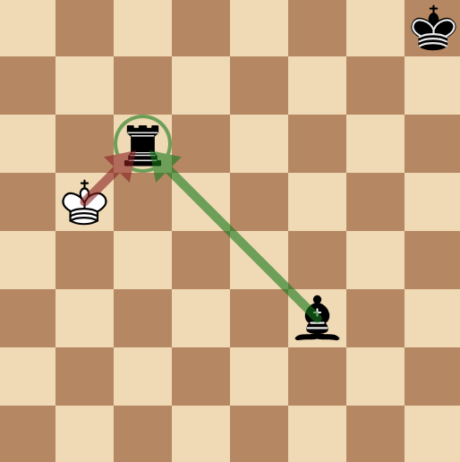

To explain, if White's king captures Black's rook, Black's bishop would take White's king, which would be an illegal move.

### Castling

Kings can perform a special move with the rook called "castling". This is the only move in chess involving two pieces and it's where a king is moved two squares toward a rook on the same rank:

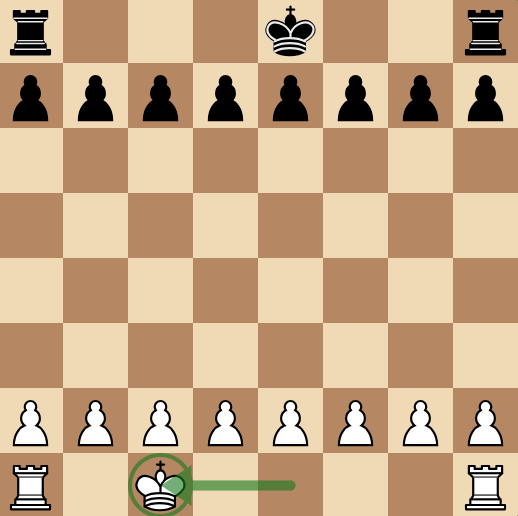

Then moving the rook to the square the king passed over:

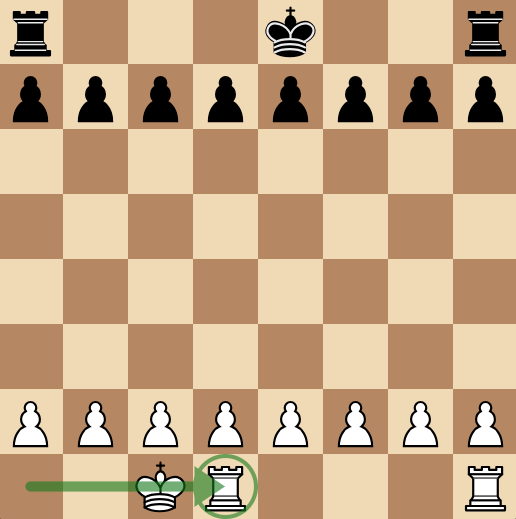

This is usually a defensive move that is played in the opening.

### Castling Requirements

Castling can only be performed if certain requirements are all met:

1. There are no pieces between the king and the rook being castled with.
2. The king, and rook being castled with, must not have moved from their starting squares.
3. The king must not be in check (threatened by an opposing piece).
4. None of the squares the king passes through are under attack.

## Pawns

Pawns are a special piece in Chess. You get the most of them compared to any piece, and they line the second and seventh ranks of the board.

 

At first, you might look at these little soldiers, worth a measly one point, and not think much of them, but they possess a few unusual traits. For example, they don't capture on the same squares they move on, and they can upgrade to other pieces.

### Movement

Pawns move one square forward. That's literally it.

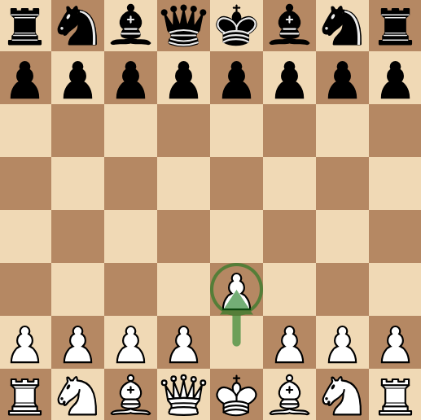

They also have the option to move two squares on their first move, but because pawns cannot jump over other pieces, they cannot move two squares if the space directly in front is blocked by any another piece.

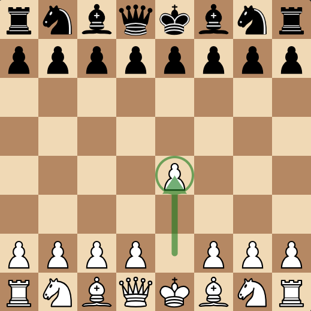

They also cannot move two spaces if the square they land on is blocked by any another piece.

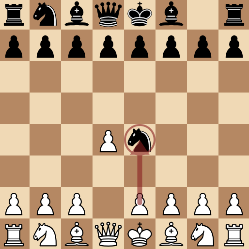

### Captures

Pawn captures are a bit weird: they don't capture on the same squares they move. Here, their capture squares are marked in red, whereas their movement squares are marked in green:

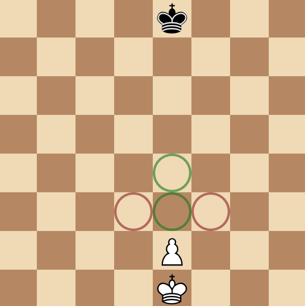

Here, you can see they capture one square up and one square either left or right of the square the pawn resides on.

### Promotions

When a pawn reaches the opposite rank of the board, it has the ability to promote to any other king besides a king: there can never be more than one king on the board at one time. This means they can become a knight, bishop, rook, or usually the most common (because it is the most valuable) option: the queen.

When promoting, you remove the pawn (removing one point from the promoting player's material count) and add back the selected piece (adding however many points the final piece is worth) on the square the pawn landed on.

### En-Passant

En-passant is French for "in passing" and it lets a pawn capture an opponent's pawn on the same rank and an adjacent file. This is only available for one move after a pawn moves two squares on its first move, and it allows that pawn moved to be taken as if it moved one space.

If that all sounds terribly confusing, I'll show some images.

Take this position for example:

White moves their pawn two squares to e4:

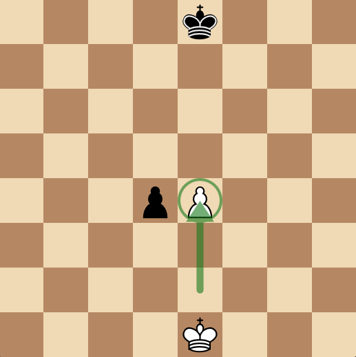

Black now has the opportunity for en-passant:

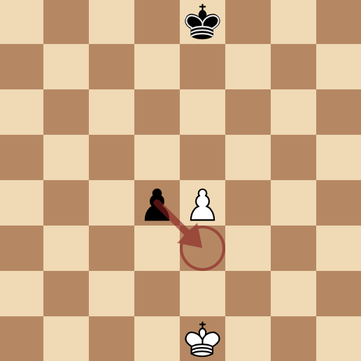

This move is the same as if the pawn moved one square forward for its turn instead of two:

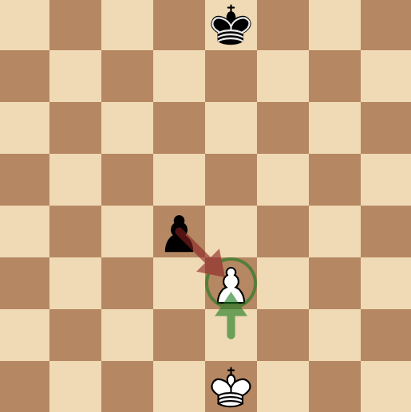

If Black chooses to move his king, instead of capturing White's pawn through en-passant, Black **cannot** play en-passant on their next turn.

***

Those are all of the movements of all the pieces in Chess. Let me know if my guide was useful, or where it can be improved, by filing an issue [here](https://github.com/axololly/chess-documentation/issues/new).