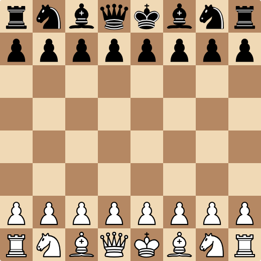
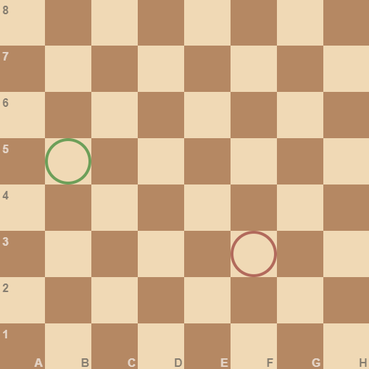

# What is Chess?

Chess is a two-player board game, simulating a battle between two kingdoms, where both players take turns moving pieces on the board with the objective of putting their opponent's king in a position where they have no escape and will be taken on the following move. It is one of the oldest and most popular games to date, with one of the first openings being the [Ponziani Opening](https://en.wikipedia.org/wiki/Ponziani_Opening), having been first discussed in chess literature no later than 1497.

The game takes place on an 8-by-8 board where each player controls 16 pieces, arranged as seen below:

### Vocabulary about Chess Boards

Before I give an overview of all the pieces and their behaviour, note these terms about chess boards:

1. **file**: _a vertical line of squares on the board._
    - The furthest on the left is labelled file A,
    - The furthest on the right is labelled file H.

2. **rank**: _a horizontal line of squares on the board._
    - The closest to White's perspective is labelled rank 1
    - The furthest from White's perspective is labelled rank 8.

Squares are also represented as `[file][rank]`, so `e4` means 5th file and 4th rank.The 5 comes from 'e' being the 5th letter of the alphabet.

For example, in the diagram below, the square highlighted with red is F3, and the square highlighted with green is B5:

